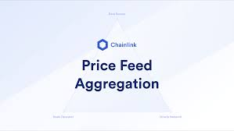

## Data Feeds

#### Chainlink Data Feeds are the quickest way to connect your smart contracts to the real-world data such as asset prices, reserve balances, and L2 sequencer health.

Read more [data feeds](https://docs.chain.link/data-feeds#overview)
