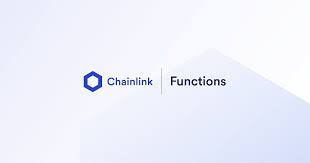

## Functions

#### Chainlink Functions provides your smart contracts access to trust-minimized compute infrastructure, allowing you to fetch data from APIs and perform custom computation. Your smart contract sends source code in a request to a [Decentralized Oracle Network (DON)](https://docs.chain.link/chainlink-functions/resources/concepts), and each node in the DON executes the code in a serverless environment. The DON then aggregates all the independent return values from each execution and sends the final result back to your smart contract.

[](https://youtu.be/p3CxiGwytHM)

Read more [functions](https://docs.chain.link/chainlink-functions)

- [Getting Started](#getting-started)
  - [Requirements](#requirements)
  - [Quickstart](#quickstart)
- [Usage](#usage)
  - [Testing](#testing)
- [Thank you!](#thank-you)

# Getting Started

## Requirements

- [git](https://git-scm.com/book/en/v2/Getting-Started-Installing-Git)
  - You'll know you did it right if you can run `git --version` and you see a response like `git version x.x.x`
- [Nodejs](https://nodejs.org/en/)
  - You'll know you've installed nodejs right if you can run:
    - `node --version` and get an ouput like: `vx.x.x`
- [Yarn](https://yarnpkg.com/getting-started/install) instead of `npm`
  - You'll know you've installed yarn right if you can run:
    - `yarn --version` and get an output like: `x.x.x`
    - You might need to [install it with `npm`](https://classic.yarnpkg.com/lang/en/docs/install/) or `corepack`

## Quickstart

```
git clone https://github.com/YourGuyD3v/ChainlinkPedia
cd ChainlinkPedia/developments
forge install
```

# Usage

## Testing

There is a contract named `GetETHPrice.sol` for demo and test contract `test/datafeeds/GetETHPrice.t.sol` for testing

for demo run this to get eth price

```
forge test --fork-url ${SEPOLIA_RPC_URL} -vvv
```

# Thank you!
